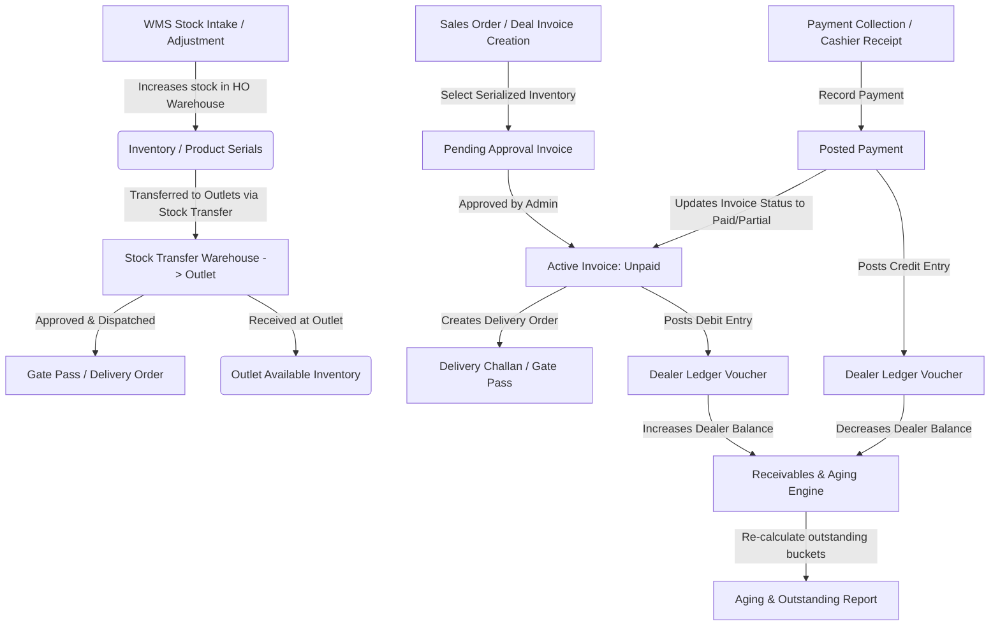

# Badarenergy ERP - Developer & System Architecture Guide

This guide explains the end-to-end business workflows, custom database triggers, model observers, service boundaries, and ledger calculation engines implemented within this Laravel ERP (Worksuite-based).

---

## 1. End-to-End Core Workflow Lifecycle

The following diagram illustrates how the modules flow and interact from initial inventory receiving to final dealer collection and ledger reconciliation:

---

## 2. Trigger Points & Code Execution Paths

Custom features hook directly into Laravel lifecycle hooks using **Observers** and **Service Classes**. Here are the exact execution hooks:

### 2.1 The Sales & Ledger Trigger Point
* **Trigger Event:** Creation or status update of an `Invoice` (e.g. from `pending_approval` to `unpaid`, `paid`, or `partial`).
* **Handling Class:** `app/Observers/InvoiceObserver.php`
* **Workflow Steps:**
  1. When an invoice status changes to active (`unpaid`/`paid`/`partial`), `InvoiceObserver@saved` calls the inventory service:
     - `InvoiceInventoryService@syncInvoiceInventory()` reserves the scanned product serials by setting their status to `sold` and linking them to the `invoice_id`.
  2. The observer then calls `DealerLedgerService@syncInvoiceEntry()`:
     - Automatically creates a debit ledger voucher (`DealerLedgerVoucher`) referencing the invoice.
     - Logs individual debit rows (`DealerLedger` records) linking the dealer's profile to post the balance change.
  3. The observer calls `DeliveryOrder::firstOrCreate()` to auto-generate a pending outbound shipment (Gate Pass) for dispatch.

### 2.2 The Payment Collection & Receipt Trigger Point
* **Trigger Event:** Creation or update of a `Payment`.
* **Handling Class:** `app/Observers/PaymentObserver.php`
* **Workflow Steps:**
  1. When a cashier submits a payment, `PaymentObserver@saved` triggers.
  2. The observer calls `DealerLedgerService@syncPaymentEntry()`:
     - Instantiates a credit ledger voucher (`DealerLedgerVoucher`) linked to the payment.
     - Logs credit entries inside the `dealer_ledgers` table to offset the dealer's debit balance.
  3. The observer calls the dealer ledger reconciliation loops to automatically offset unpaid invoices chronologically (FIFO aging matching).

### 2.3 The WMS Stock Transfer Trigger Point
* **Trigger Event:** Changing a stock transfer status to `Dispatched` (`STATUS_DISPATCHED`).
* **Handling Class:** `app/Services/TransferDispatchService.php`
* **Workflow Steps:**
  1. The controller calls `TransferDispatchService@dispatch()` within a database transaction.
  2. Product inventory quantities in the source warehouse are reduced, and `quantity_in_transit` is increased.
  3. Mapped serial numbers (`product_serials`) status is updated to `in_transit`.
  4. A Gate Pass record is automatically created in the `delivery_orders` table with type `transfer`.

---

## 3. Custom Modules Breakdown

### 3.1 Dealer Management & Ledgers
* **Key Tables:** 
  - `dealer_ledger_vouchers`: Groups double-entry ledger listings.
  - `dealer_ledgers`: Contains the ledger ledger rows (`debit`, `credit`, `balance_running`, `dealer_id`).
* **Reconciliation Rules:**
  - Running balance is computed using:
    $$\text{Balance} = \sum \text{Debits} - \sum \text{Credits}$$
  - Balanced postings are guaranteed using MySQL transactions.

### 3.2 Inventory & Serialized Tracking
* **Key Tables:**
  - `inventories`: Tracks aggregate quantity per warehouse.
  - `product_serials`: Tracks individual serial codes and states (`available`, `reserved`, `dispatched`, `sold`, `faulty`).
* **Acquisition Flow:**
  - Standard adjustments are routed via `InventoryController@store` calling `StockAdjustmentService`.
  - Serial statuses dictate availability. Mapped serials cannot be reused in invoices or transfers while marked `reserved` or `sold`.

### 3.3 Logistics & Dispatch (Gate Passes)
* **Key Tables:**
  - `delivery_orders`: Holds both invoice shipments and stock transfer Gate Passes polymorphically.
* **Logistics Parameters:**
  - Tracks `dispatcher_id`, `vehicle_number`, `driver_name`, and `shipping_charges`.
  - The printable Challan/Gate Pass adapts titles dynamically based on `source_type`.

---

## 4. Troubleshooting & Debugging

When tracing issues, inspect the following key files:

| Custom Feature | Service Class Location | Database Table |
| :--- | :--- | :--- |
| **Sales Inventory Reservation** | `app/Services/InvoiceInventoryService.php` | `product_serials`, `inventories` |
| **Dealer Ledger Balances** | `app/Services/DealerLedgerService.php` | `dealer_ledgers`, `dealer_ledger_vouchers` |
| **WMS Stock Movements** | `app/Services/StockTransferService.php` | `stock_transfers`, `transfer_items` |
| **Logistics & Dispatch Gate Pass** | `app/Http/Controllers/DeliveryOrderController.php` | `delivery_orders` |
| **Aging Bucket Calculations** | `app/Services/DealerAgingService.php` | `dealer_aging_snapshots` |

---

## 5. Typical Execution Flow: Step-by-Step Example

1. **Intake Stock:** Adjust stock via `/account/inventory` to set initial quantities and register product serials.
2. **Transfer Stock:** Go to `/account/stock-transfers/create` to draft a transfer request.
3. **Dispatch Shipment:** Approve the transfer and dispatch it. This generates a **Gate Pass** inside the Delivery Orders list.
4. **GRN Receipt:** The destination outlet warehouse clicks "Confirm Receipt" on the transfer view to update inventory balances at the outlet.
5. **Invoice Deal:** Create an invoice. Upon approval, the inventory is reserved and the **Dealer Ledger** is automatically debited.
6. **Payment collection:** Record a payment for the invoice. This posts a credit ledger voucher and reconciles the dealer account balance.
